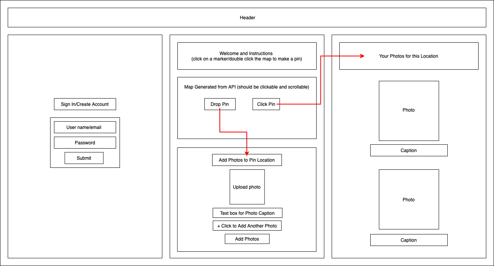

# Capstone

#### _Capstone Project for Epicodus, 7/16/2021_

#### By _**Tiffany Greathead**_

## Description

An application that allows users to store photos, travel information, and track their favorite places to visit. Users will need an image URL to add photos. To create an image URL for personal photos, sign up for a free account with apps such as [flickr](https://www.flickr.com/photos/flickr/) or [imgur](https://imgur.com/). Instructions for locating the image URL after uploading the desired photos to these apps are listed below:

- [flickr](https://help.flickr.com/en_us/share-or-embed-flickr-photos-or-albums-rJBx6mjyX)
- [imgur](https://help.imgur.com/hc/en-us/articles/115000524806-Sharing-Posts-GIFs-GIFvs-and-Images-)

## Component Tree



## Setup/Installation Requirements

Software Requirements

1. Internet browser
2. A code editor like VSCode or Atom to view or edit the codebase

Open via Bash/GitBash:

1. Clone this repository onto your computer:
   `git clone https://github.com/TorchAblaze/capstone.git`
2. Navigate into the `capstone` directory, and open in Visual Studio Code or preferred text editor
3. Run `npm install` to install the dependencies
4. To setup a SQL database using MySQL:
   - Create an `appsettings.json` file in the `capstone/RestServer` directory
   - Copy the text box below and paste into the `appsettings.json` file, replacing `<password>` with your MySQL password:
   ```
     {
        "ConnectionStrings": {
           "DefaultConnection": "Server=localhost;Port=3306;database=tiffany_greathead;uid=root;pwd=<password>;"
         }
     }
   ```
   - Open your terminal and run the command: `mysql -uroot -p<mysql_password>` (replace `<mysql_password>` with your MySQL password) and select the enter key to launch MySQL servers
5. To run the console app:
   - Navigate to `capstone/RestServer` in your command line
   - Run the commands:
     - `dotnet restore` to restore the dependencies that are listed in `Factory.csproj`
     - `dotnet build` to build the project and its dependencies into a set of binaries
     - `dotnet tool install --global dotnet-ef` to install EF Core tools
     - `dotnet ef migrations add Initial` and `dotnet ef database update`
   - Run the command `dotnet run` to run the project
   - Note: `dotnet run` also restores and builds the project, so you can use this single command to start the console app
6. Navigate back to the `capstone` directory and run `npm start` to view the application
7. Visit the application via web browser at: `localhost:3000/`

## Known Bugs

_This project is a work in progress_

## Support and contact details

_Please reach out through my GitHub account._

## Technologies Used

- CSS
- HTML
- JavaScript
- Node
- React
- C#
- .NET 5 SDK
- ASP.NET
- Entity Framework Core
- MySQL

# Getting Started with Create React App

<details>

This project was bootstrapped with [Create React App](https://github.com/facebook/create-react-app).

## Available Scripts

In the project directory, you can run:

### `yarn start`

Runs the app in the development mode.\
Open [http://localhost:3000](http://localhost:3000) to view it in the browser.

The page will reload if you make edits.\
You will also see any lint errors in the console.

### `yarn test`

Launches the test runner in the interactive watch mode.\
See the section about [running tests](https://facebook.github.io/create-react-app/docs/running-tests) for more information.

### `yarn build`

Builds the app for production to the `build` folder.\
It correctly bundles React in production mode and optimizes the build for the best performance.

The build is minified and the filenames include the hashes.\
Your app is ready to be deployed!

See the section about [deployment](https://facebook.github.io/create-react-app/docs/deployment) for more information.

### `yarn eject`

**Note: this is a one-way operation. Once you `eject`, you can’t go back!**

If you aren’t satisfied with the build tool and configuration choices, you can `eject` at any time. This command will remove the single build dependency from your project.

Instead, it will copy all the configuration files and the transitive dependencies (webpack, Babel, ESLint, etc) right into your project so you have full control over them. All of the commands except `eject` will still work, but they will point to the copied scripts so you can tweak them. At this point you’re on your own.

You don’t have to ever use `eject`. The curated feature set is suitable for small and middle deployments, and you shouldn’t feel obligated to use this feature. However we understand that this tool wouldn’t be useful if you couldn’t customize it when you are ready for it.

## Learn More

You can learn more in the [Create React App documentation](https://facebook.github.io/create-react-app/docs/getting-started).

To learn React, check out the [React documentation](https://reactjs.org/).

### Code Splitting

This section has moved here: [https://facebook.github.io/create-react-app/docs/code-splitting](https://facebook.github.io/create-react-app/docs/code-splitting)

### Analyzing the Bundle Size

This section has moved here: [https://facebook.github.io/create-react-app/docs/analyzing-the-bundle-size](https://facebook.github.io/create-react-app/docs/analyzing-the-bundle-size)

### Making a Progressive Web App

This section has moved here: [https://facebook.github.io/create-react-app/docs/making-a-progressive-web-app](https://facebook.github.io/create-react-app/docs/making-a-progressive-web-app)

### Advanced Configuration

This section has moved here: [https://facebook.github.io/create-react-app/docs/advanced-configuration](https://facebook.github.io/create-react-app/docs/advanced-configuration)

### Deployment

This section has moved here: [https://facebook.github.io/create-react-app/docs/deployment](https://facebook.github.io/create-react-app/docs/deployment)

### `yarn build` fails to minify

This section has moved here: [https://facebook.github.io/create-react-app/docs/troubleshooting#npm-run-build-fails-to-minify](https://facebook.github.io/create-react-app/docs/troubleshooting#npm-run-build-fails-to-minify)

</details>

### License

MIT License

Copyright (c) 2021 Tiffany Greathead
